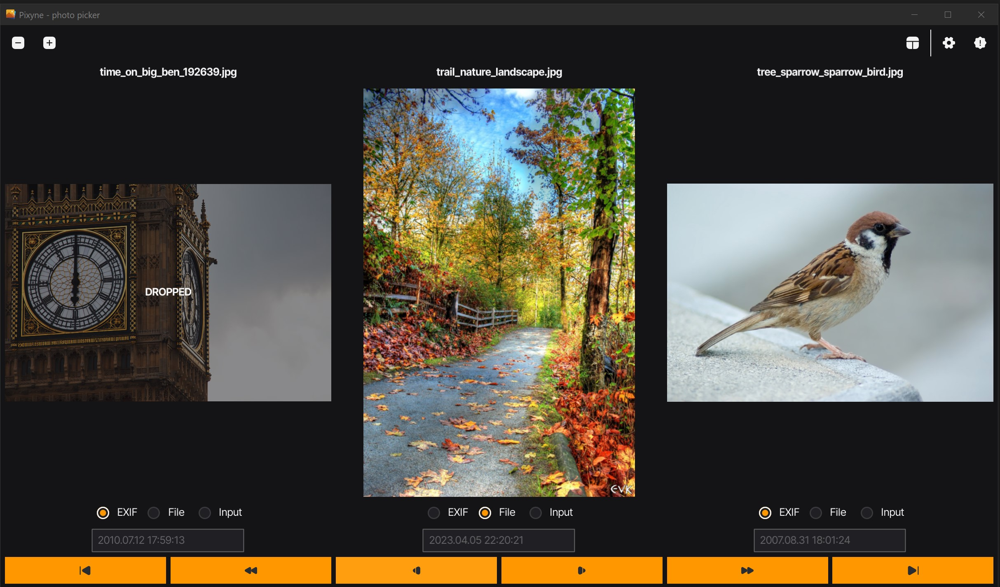
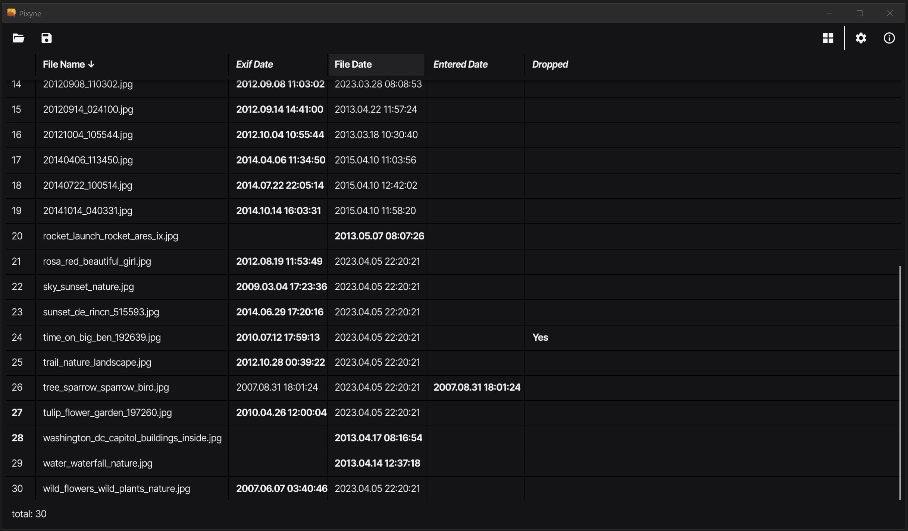

---
### Use Pixyne to quickly review your photo folders, safely delete bad and similar shots, and fix the shooting dates.  

---




## How to use

Pixyne application has a simple and intuitive interface, but there are some non-obvious things:   
* With a click on photo you can mark to drop it in the trash.
* When you are in a list view, clicking on a list row opens the corresponding photo.  
* You may also set or correct the EXIF shooting date to the file date or to a manually entered date.
* When you save changes, you can change all file names to EXIF shooting date format.  
* Made changes will not actually be applied until you save. Pixyne automaticaly stores the current state of the folder so you can undo changes at any time. This is useful when working with a large number of photos and when you need to close the application in order to continue working later. If you open another folder, all unsaved changes will be lost.
* On save originals of modified photos will be copied to "originals" subfolder and photos marked to drop will be moved to "dropped" subfolder.  


## Installation

The easiest way to install the application is to download and run the installation file from the [latest release](https://github.com/vinser/pixyne/releases/tag/v1.1.0) that matches your operating system and CPU type.

|OS        |CPU type              |Install package            |Tested* |  
|----------|----------------------|---------------------------|:------:|  
|Linux     | Intel, AMD 64-bit    | pixyne-linux-amd64.tar.xz |No      |  
|Linux     | Intel, AMD 32-bit    | pixyne-linux-386.tar.xz   |No      |
|Linux     | ARM 64-bit           | pixyne-linux-arm64.tar.xz |Yes     |
|Linux     | ARM 32-bit           | pixyne-linux-arm.tar.xz   |No      |
|OS X (MAC)| Intel 64-bit         | pixyne-macosx-amd64.dmg   |No      |  
|OS X (MAC)| ARM 64-bit           | pixyne-macosx-arm64.dmg   |No      |  
|Windows   | Intel, AMD 64-bit    | pixyne-windows-amd64.msi  |Yes     |  
|Windows   | Intel, AMD 32-bit    | pixyne-windows-386.msi    |Yes     |

\*_Some of packages was only cross-builded and not tested on real desktops, but you can still try them out_  

You can also build Pixine app from the source code right for your desktop using the `fyne-cross` command.  
To do so you will need to have `Go` compiler and `docker` installed.   
Ones set up install `fyne-cross` using the following command (requires Go 1.16 or later)
```
go install github.com/fyne-io/fyne-cross@latest
```
Then download Pixyne app code directly from git
```
git clone https://github.com/vinser/pixyne.git
```
and build app using `fyne-cross` with your `OS` option  
```
fyne-cross <linux|darwin|windows>
```
Enjoy!

---
*Created using [Fyne](https://github.com/fyne-io/fyne) GUI library*  
*App icon designed by [Icon8](https://icon8.com)*  

